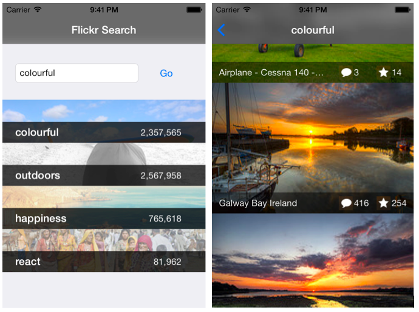

#ReactiveCocoa, Swift and MVVM

This application is a Swift-port of an MVVM / ReactiveCocoa example application [I wrote a few months ago](https://github.com/ColinEberhardt/ReactiveFlickrSearch).

##Instructions

This project uses a combination of both CocoaPods and git submodules. The reason for this is that the current version of ReactiveCocoa is not compatible with Swift, as [detailed in this blog post](http://www.scottlogic.com/blog/2014/07/24/mvvm-reactivecocoa-swift.html).

In order to use this project you need to clone the repo and [also clone the submodules](http://stackoverflow.com/questions/3796927/how-to-git-clone-including-submodules). The following commands should be all you need to get started:

    git clone --recursive https://github.com/ColinEberhardt/ReactiveSwiftFlickrSearch.git
    cd ReactiveSwiftFlickrSearch
    pod install

Open the workspace in Xcode, and select the ReactiveSwiftFlickrSearch target, build and run.

The project has been tested on Xcode 6.1 (RTM)
